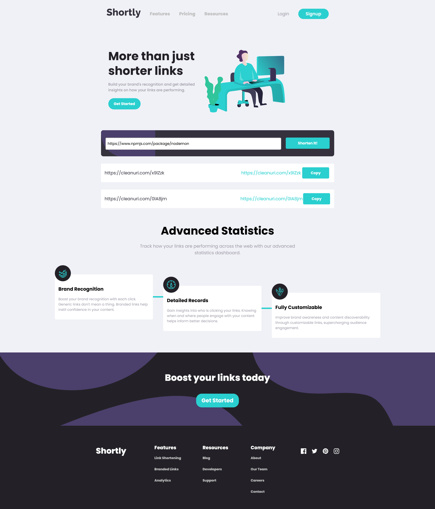

# Frontend Mentor - Shortly URL shortening API Challenge solution

This is a solution to the [Shortly URL shortening API Challenge challenge on Frontend Mentor](https://www.frontendmentor.io/challenges/url-shortening-api-landing-page-2ce3ob-G). Frontend Mentor challenges help you improve your coding skills by building realistic projects.

## Table of contents

- [Overview](#overview)
  - [The challenge](#the-challenge)
  - [Screenshot](#screenshot)
  - [Links](#links)
- [My process](#my-process)
  - [Built with](#built-with)
  - [What I learned](#what-i-learned)
  - [Continued development](#continued-development)
  - [Useful resources](#useful-resources)
- [Author](#author)

## Overview

### 💪 The challenge

Users should be able to:

- View the optimal layout for the site depending on their device's screen size
- Shorten any valid URL
- See a list of their shortened links, even after refreshing the browser
- Copy the shortened link to their clipboard in a single click
- Receive an error message when the `form` is submitted if:
  - The `input` field is empty

### 📸 Screenshot

### 🔗 Links

- Solution URL: [React-URL-Shorten](https://github.com/Miki0035/react-url-shorten)
- Live Site URL: [Shortly](https://react-url-shorten-cgay.onrender.com/)
- Live Proxy Server" [Proxy Server](https://proxy-cleanurl.onrender.com/)

## 🤔 My process

### 🛠️ Built with

- Semantic HTML5 markup
- CSS custom properties
- Flexbox
- CSS Grid
- Mobile-first workflow
- [Vite](https://vite.dev/) - Build Tool for the Web
- [React](https://reactjs.org/) - JS library
- [Node.js](https://nodejs.org) - Node.js framework

### 👨‍🏫 What I learned

This project is a bit different not just from the visual aspect side , that challenged me to use CSS grid and code responsive designes way faster, but I built my first proxy server , in [Node.js](https://nodejs.org) , in order to fetch the shortened URL coming from using [Cleanuri](https://cleanuri.com). This really expanded my knowledge of web security especally Cross-Origin-Resource-Sharing(CORS) errors. I now know what they are and how to resolve this issues going forward as a frontend developer. Thanks 😃 [Frontend Mentor](https://www.frontendmentor.io) for expanding my knowledge with this project.

### 🏃‍♂️ Continued development

Areas that I want to focus more on are

- API integration
- Application Deployment (CI/CD pipleine)
- Usage of svg image files

### 📚 Useful resources

- [Pedro Tech](https://www.youtube.com/watch?v=qnA_h_PzJD0&ab_channel=PedroTech) - This helped me understand what CORS errors are and where they are occuring from
- [ChatGPT](https://chatgpt.com) - This AI helped me build my proxy server for my app

## 👨‍🦱 Author

- Website - [Mikiyas Kebede](https://my-portfolio-pvae.onrender.com)
- Frontend Mentor - [@Miki0035](https://www.frontendmentor.io/profile/Miki0035)
- Github - [@Miki0035](https://github.com/Miki0035)
